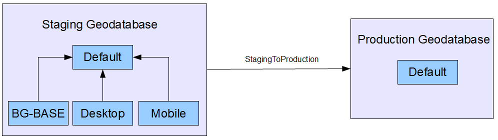
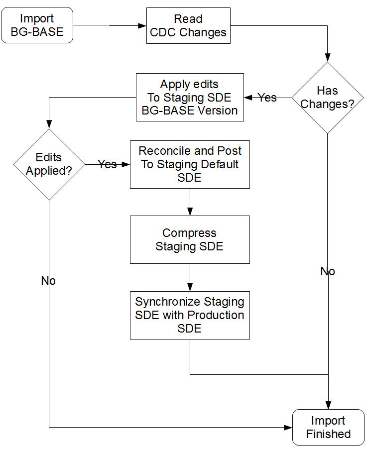
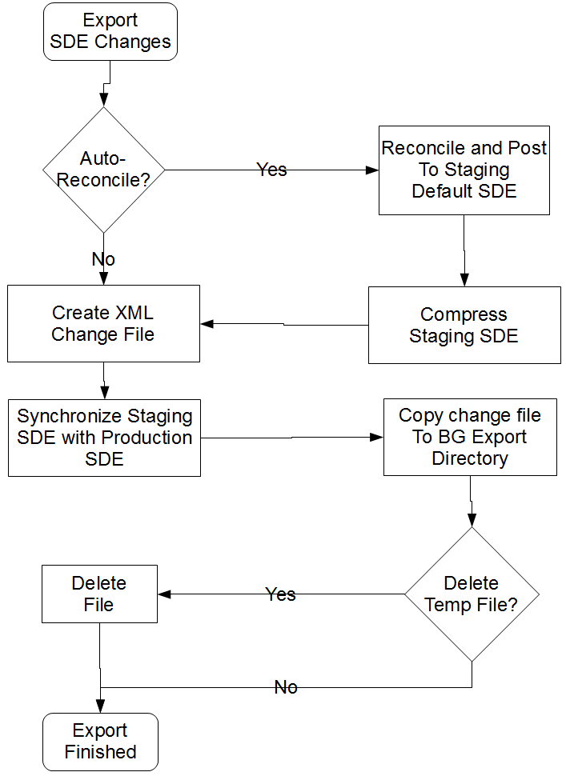

BG-BASE Connector
================================

Background
----------
The BG-BASE Connector is a Python library that was written to synchronize data stored in BG-BASE and an ArcGIS 10.1 Enterprise Geodatabase.
The connector was written using Python 2.7, the Python 32-bit ODBC client and the ArcGIS 10.1 Python library.

Methodology
-----------
*Data Import*
The database synchronization between BG-BASE and ArcGIS is achieved via multiple technologies. BG-BASE stores changes in various tables in a Microsoft SQL Server database (Warehouse). Change Data Capture (CDC) is enabled for the Warehouse tables that participate in synchronization. BG-BASE calls a batch file, which in turn calls a python file that launches the connector to initiate the BG-BASE to ArcGIS process (data import).

The connector reads a configuration table stored in the Warehouse database (described below) to determine which tables participate in the synchronization process. The connector calls CDC functions stored in the configuration table to read changes from BG-BASE, parses the changes, and stores the changes in the ArcGIS Geodatabase. The CDC function calls and parsing of the Warehouse data is accomplished via the Python ODBC client, and the data loading into the ArcGIS Geodatabase is accomplished via the ArcGIS Python library.

***Configuration Table (Warehouse.dbo.SDE_SYNC_TABLES)***
<table>
	<tr>
		<th>Column Name</th>
		<th>Description</th>
	</tr>
	<tr>
		<td>TABLE_NAME</td>
		<td>Name of the table in the ArcGIS database to receive the changes.</td>
	</tr>
	<tr>
		<td>CDC_TABLE_NAME</td>
		<td>Name of the table in the SQL Server warehouse database.
		This can be a view.</td>
	</tr>
	<tr>
		<td>CDC_FUNCTION</td>
		<td>The name of the function that the script will call to read the changes from BG-BASE.</td>
	</tr>
	<tr>
		<td>PK_FIELD</td>
		<td>The primary key field name in the Warehouse table and ArcGIS table
		(must be the same in bothe databases).</td>
	</tr>
	<tr>
		<td>X_FIELD</td>
		<td>Optional. The field name that contains the Longitude data for the table.</td>
	</tr>
	<tr>
		<td>Y_FIELD</td>
		<td>Optional. The field name that contains the Latitude data for the table.</td>
	</tr>
	<tr>
		<td>DISABLED</td>
		<td>If set to 1, then the script will ignore this table.</td>
	</tr>
	<tr>
		<td>LAST_SYNC_DATE</td>
		<td>The last time this table was synchronized.</td>
	</tr>
</table>

*Data Export*
The database synchronization between ArcGIS and BG-BASE is achieved using ArcGIS geodatabase replicas. An ArcGIS user launches a batch file that calls the connector data export routine. The connector uses ArcGIS geoprocessing tools to create an XML data change file, which contains data changes that have been made by users using ArcGIS software, and then exports the XML change file to a location where BG-BASE reads the XML data change file. BG-BASE then applies the data changes to the BG-BASE tables.

Geodatabase Design
------------------
*Databases*
The enterprise geodatabase contains 2 databases named Staging and Production. A geodatabase replica named StagingToProduction sits in between the 2 geodatabases, and is used to synchronize the data between Staging and Production. The replica is a one-way replica, with the Staging database as the parent and the Production database as a child to Staging. In this scenario, the Production database is a clone of the Staging database, with users making their edits in Staging and Profuction serving as a resd-only database.

*Versions*
There are 3 versions in the Staging geodatabase besides the Default database: BG-BASE, Desktop and Mobile. The BG-BASE version is where the connector writes edits from the CDC data from the Warehouse database. The Desktop and Mobile versions store edits made by users and are used in the data export process.

Visual representation of geodatabase design:

Python Code
-----------
The connector is made of several Python classes, with 2 launcher files sitting at the top of the package structure.

* util: Package that contains classes that perform various utility functions
	* Config: Class that reads the property file that runs the connector.
	* DateUtil: Class that performs various date/string operations.
	* DBUtil: Class that performs various operations against the Python ODBC client record sets.
	* LockFile: Class that writes out a lock file during the duration of the data import routine.
* bgbase: Package that contains classes that interact with objects to read BG-BASE data.
	* Warehouse: Class that encapsulates the Warehouse Configuration Table.
* bgimport: Package that contains classes that perform data import routines to move data from BG-BASE to ArcGIS.
	* WarehouseToSde: Class that calls the CDC functions to read the data changes from BG-BASE and imports the changes into ArcGIS.
* bgexport: Package that contains classes that create the data changes files for BG-BASE.
	* SdeToWarehouse: Class that calls ArcGIS geoprocessing tools to create the XML data change files fot BG-BASE to consume.
* top level:
	* warehouse_to_sde: Script that creates an intance of bgimport.WarehouseToSde and calls the class' run method.
	* sde_to_warehouse: Script that creates an intance of bgeport.SdeToWarehouse and calls the class' run method.

Configuration
-------------
The connector is configured with a Java-like property file. The property file is referenced by the warehouse_to_sde and sde_to_warehouse scripts and contains the following properties:

<table>
	<tr>
		<th>Property</th>
		<th>Description</th>
		<th>Example</th>
	</tr>
	<tr>
		<td>importLogFile</td>
		<td>Path to import log file</td>
		<td>C:\temp\warehouse_to_sde.log</td>
	</tr>
	<tr>
		<td>exportLogFile</td>
		<td>Path to export log file</td>
		<td>C:\temp\sde_to_warehouse.log</td>
	</tr>
	<tr>
		<td>server</td>
		<td>Name of SQL Server.</td>
		<td>servername.harvard.edu</td>
	</tr>
	<tr>
		<td>database</td>
		<td>SQL Server Database that contains the Warehouse data</td>
		<td>Warehouse</td>
	</tr>
	<tr>
		<td>adminTable</td>
		<td>Table name that contains the datasets that are configured for BG-BASE synchronization</td>
		<td>dbo.SDE_SYNC_TABLES</td>
	</tr>
	<tr>
		<td>stagingWorkspace</td>
		<td>Path to SDE Connection file to Staging Geodatabase</td>
		<td>C:\temp\Staging@ARCGIS10.sde</td>
	</tr>
	<tr>
		<td>productionWorkspace</td>
		<td>Path to SDE Connection file to Production Geodatabase</td>
		<td>C:\temp\Production@ARCGIS10.sde</td>
	</tr>
	<tr>
		<td>bgbaseEditVersion</td>
		<td>SDE version name in Staging SDE to perform BG-BASE-originated edtis</td>
		<td>DBO.BG-BASE</td>
	</tr>
	<tr>
		<td>stagingEditVersions</td>
		<td>Comma-delimited list of versions in Staging SDE to reconcile and post edits made in ArcGIS by users if autoReconcile is true</td>
		<td>DBO.DESKTOP,DBO.MOBILE</td>
	</tr>
	<tr>
		<td>replica</td>
		<td>Name of replica between Staging and Production.</td>
		<td>DBO.StagingToProduction</td>
	</tr>
	<tr>
		<td>lockFilePath</td>
		<td>Lock file location</td>
		<td>C:\temp\bgimport.loc</td>
	</tr>
	<tr>
		<td>tempPath</td>
		<td>Temp directory where XML change files are created.</td>
		<td>C:\temp\bgtemp</td>
	</tr>
	<tr>
		<td>exportPath</td>
		<td>Directory where XML change files are picked up by BG-BASE.</td>
		<td>C:\temp\bgexport</td>
	</tr>
	<tr>
		<td>deleteTempFiles</td>
		<td>true|false. If true, deletes XML change files in directory set in tempPath</td>
		<td>true</td>
	</tr>
	<tr>
		<td>autoReconcile</td>
		<td>true|false. If true, reconciles edits from Production edit to Production default before</td>
		<td>true</td>
	</tr>
</table>

Flow Charts
-------------
*Data Import*

*Data Export*
